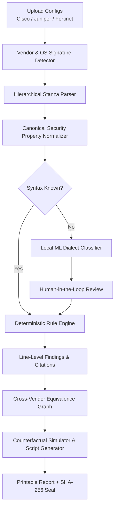

# 🛡️ ARGUS: AI-Driven Multi-Vendor Network Security Compliance Auditor
### Problem Statement ID: SIH26155 | Smart India Hackathon 2026

[](https://argus-auditor.web.app/)
[](https://github.com/Prathamwadiyar/Argusss)
[](./Architecture%20Document.pdf)
[](https://github.com/Prathamwadiyar/Argusss)
[](https://github.com/Prathamwadiyar/Argusss)
[](https://github.com/Prathamwadiyar/Argusss)

---

## ⚡ What is ARGUS?

**ARGUS** is an air-gapped, AI-powered compliance auditor designed to inspect heterogeneous network fleets (**Cisco IOS-XE, Juniper Junos, and Fortinet FortiOS**) against strict cybersecurity frameworks like **CIS Benchmarks, NIST SP 800-53, DISA STIGs, ISO 27001, and NCIIPC guidelines**.

Unlike generic cloud AI tools that leak sensitive configuration data over the internet or hallucinate compliance passes, **ARGUS operates 100% offline** on local CPU hardware using a **Dual-Engine Architecture**:
1. **Deterministic Rules Engine**: Evaluates security policies with zero hallucination and line-by-line evidence citations.
2. **Local AI Dialect Engine**: Learns unfamiliar CLI syntaxes offline in sub-milliseconds using TF-IDF character $n$-grams and Logistic Regression.

---

## 🚀 Live Demo & Documentation

- 🌐 **Live Web Prototype**: [https://argus-auditor.web.app/](https://argus-auditor.web.app/)
- 📄 **Architecture Specification Document**: [Architecture Document (PDF)](./Architecture%20Document.pdf)
- 🐙 **GitHub Repository**: [https://github.com/Prathamwadiyar/Argusss.git](https://github.com/Prathamwadiyar/Argusss.git)

---

## 💡 Why ARGUS? The Core Problem & Solution

| The Challenge | Traditional Tools / Cloud AI | The ARGUS Solution |
| :--- | :--- | :--- |
| **Air-Gap Requirement** | Cloud LLMs leak topology, ACLs, and keys over the internet. | 🔒 **100% Air-Gapped & Offline**: Runs completely on local hardware. Zero internet calls. |
| **Audit Hallucination** | Generative AI hallucinates compliance verdicts on complex ACLs. | 📐 **Deterministic Proof**: Mathematical rule engine guarantees 0% hallucination. |
| **Vendor CLI Churn** | Static regex tools break whenever Cisco, Juniper, or Fortinet update CLI keywords. | 🧠 **Self-Evolving Local AI**: Classifies unknown dialects offline in <0.4ms with confidence scores. |
| **Remediation Risk** | Manual remediation is slow and error-prone. | 🔮 **Counterfactual Simulator**: Simulates score gain before touching hardware & generates CLI fixes. |

---

## 🌟 5 Key Innovations

```
                               ARGUS CORE INNOVATIONS
 ┌───────────────────────────┬─────────────────────────────────────────────────────────┐
 │ 01. Local Dialect Engine  │ Learns unfamiliar vendor CLI syntaxes offline via ML.   │
 ├───────────────────────────┼─────────────────────────────────────────────────────────┤
 │ 02. Intent Compiler       │ Converts plain English policies into formal logic AST.  │
 ├───────────────────────────┼─────────────────────────────────────────────────────────┤
 │ 03. Equivalence Graph     │ Maps Cisco, Juniper & Fortinet to common properties.    │
 ├───────────────────────────┼─────────────────────────────────────────────────────────┤
 │ 04. "What-If" Simulator   │ Projects score lift & generates vendor CLI fixes.       │
 ├───────────────────────────┼─────────────────────────────────────────────────────────┤
 │ 05. Knowledge Reversal    │ Retains full rule provenance & tracks blast-radii.      │
 └───────────────────────────┴─────────────────────────────────────────────────────────┘
```

1. 🤖 **Self-Evolving Local Dialect Engine (PRD DIF-01)**: Unrecognized vendor syntax is automatically analyzed by a local ML model (TF-IDF + Logistic Regression) without leaving the machine.
2. 💬 **Universal Security Intent Compiler (PRD DIF-02)**: Type requirements in plain English (*"Ensure management uses SSH only and central logging is enabled"*), and ARGUS compiles them into executable logical constraints.
3. 🕸️ **Cross-Vendor Equivalence Graph (PRD DIF-03)**: Normalizes disparate vendor syntaxes into unified **Canonical Security Properties** (`mgmt.ssh_only`, `logging.central_syslog`, etc.).
4. 🔮 **Counterfactual Security Simulator (PRD DIF-04)**: A dry-run sandbox that simulates fixes in memory, projects exact compliance score improvements, and synthesizes copy-paste vendor CLI hardening scripts.
5. 📜 **Auditable Knowledge & Blast-Radius Reversal (PRD DIF-05)**: Every learned rule maintains complete provenance. Revoking a rule automatically traces all past audits and flags impacted findings.

---

## 🔄 How It Works: The 10-Stage Pipeline



---

## 🎛️ Multi-Vendor Syntax Mapping

ARGUS automatically normalizes different CLI commands into unified security properties:

| Security Property | Cisco IOS-XE | Juniper Junos | Fortinet FortiOS | Canonical Key |
| :--- | :--- | :--- | :--- | :--- |
| **SSH-Only Transport** | `transport input ssh` | `system { services { ssh; } }` | `set admin-ssh-access enable` | `mgmt.ssh_only` |
| **Session Inactivity Timeout** | `exec-timeout 10 0` | `cli idle-timeout 15` | `set admintimeout 10` | `mgmt.session_timeout` |
| **Password Hardening** | `service password-encryption` | `encrypted-password "..."` | `set password-policy ...` | `auth.password_min_length` |
| **Central Syslog** | `logging host 10.0.0.50` | `system { syslog { host ... } }` | `config log syslogd setting` | `logging.central_syslog` |
| **Time Sync (NTP)** | `ntp server 10.0.0.1` | `system { ntp { server ... } }` | `config system ntp` | `time.ntp_servers` |

---

## ⚡ Quickstart & Local Setup

### Prerequisites
- **Python 3.10+**
- **Node.js 18+**

### Option 1: 1-Click Launch (Windows)
Double-click `start.bat` or run:
```cmd
start.bat
```
This automatically starts both the **FastAPI Backend** (`http://localhost:8000`) and **React Frontend** (`http://localhost:5173`).

---

### Option 2: Manual Setup

#### 1. Clone the repository
```bash
git clone https://github.com/Prathamwadiyar/Argusss.git
cd Argusss
```

#### 2. Start Backend (FastAPI)
```bash
pip install -r backend/requirements.txt
python -m uvicorn backend.main:app --host 0.0.0.0 --port 8000 --reload
```

#### 3. Start Frontend (React + Vite)
```bash
cd frontend
npm install
npm run dev
```

---

## 🧪 Automated Testing

Run the full pytest suite to verify all deterministic logic, ML classification, intent compiler, and simulator:

```bash
python -m pytest tests/test_auditor.py -v
```

---

## 📂 Repository Structure

```text
SIH/
├── Architecture Document.pdf       # Full technical architecture specification
├── start.bat                      # 1-Click launcher script (FastAPI + Vite)
├── backend/                       # Python FastAPI Backend
│   ├── main.py                    # REST API routes & app lifecycle
│   ├── parser.py                  # Multi-vendor signature detector & stanza parser
│   ├── compliance.py              # Deterministic CIS & NIST rule evaluator
│   ├── ai.py                      # Local ML Dialect Engine (TF-IDF + Logistic Regression)
│   ├── intent_compiler.py         # Natural language NLP to AST logic compiler
│   ├── simulator.py               # Counterfactual security simulator & CLI generator
│   └── database.py                # SQLite ORM models
├── frontend/                      # React 18 + Vite + Tailwind CSS Frontend
│   └── src/
│       ├── pages/                 # Landing Page, Dashboard, Login Page
│       ├── components/            # 10 Interactive Operation Tabs
│       └── services/              # API client & offline fallback engine
├── data/                          # Seed database, sample configs & ML models
└── tests/                         # Automated test suite (pytest)
```

---

## 🏆 Hackathon Details

- **Problem Statement ID**: SIH26155
- **Hackathon**: Smart India Hackathon 2026
- **Live Demo**: [https://argus-auditor.web.app/](https://argus-auditor.web.app/)
- **License**: Open Source (ISC)