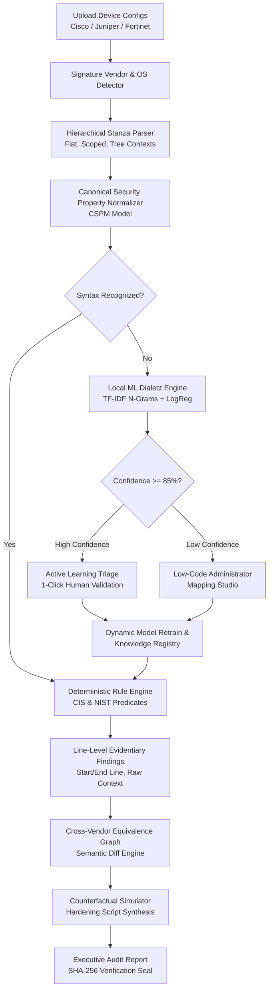

# ARGUS: AI-Augmented Multi-Vendor Network Security Compliance Auditor
### Problem Statement ID: SIH26155 | Smart India Hackathon 2026

[](https://argus-auditor.web.app/)
[](https://github.com/Prathamwadiyar/SIH2026)
[](./Architecture%20Document.pdf)
[](https://github.com/Prathamwadiyar/SIH2026)
[](https://github.com/Prathamwadiyar/SIH2026)
[](https://github.com/Prathamwadiyar/SIH2026)
[](https://github.com/Prathamwadiyar/SIH2026)

---

## 🌐 Live Deployed Prototype & Architecture Specification

> 🚀 **Live Interactive Prototype (Firebase):**  
> Test the deployed application live in your browser:  
> 👉 **[https://argus-auditor.web.app/](https://argus-auditor.web.app/)** 👈
>
> 📄 **Complete System Architecture Specification Document:**  
> The comprehensive engineering architecture document is committed in the root repository.  
> 👉 **[Click Here to Open Architecture Document (PDF)](./Architecture%20Document.pdf)** 👈  
> *(Native browser PDF rendering available directly within GitHub)*

---

## 📌 Executive Summary & Context

Modern national critical infrastructure—including defense backbones, banking networks, telecom backhauls, and power utilities governed by **NCIIPC** and **CERT-In**—relies on heterogeneous, multi-vendor network fleets (**Cisco IOS/IOS-XE, Juniper Junos, Fortinet FortiOS, Arista EOS**).

Auditing these configurations manually or via static scripts presents three fatal bottlenecks:
1. **The Air-Gap Constraint:** Mission-critical and defense networks strictly forbid transmitting configuration files (which expose cryptographic keys, topology, internal IPs, and ACLs) to third-party public cloud LLMs (OpenAI, Gemini Cloud, Claude APIs).
2. **The "Hallucination in Auditing" Fatality:** Generative LLMs hallucinate false passes or misses on firewall and transport rules. Auditing must be **100% deterministic, mathematically verifiable, and backed by line-level cryptographic proof**.
3. **The Syntactic Churn Problem:** Vendor CLI keywords mutate with firmware upgrades (e.g., Junos `system { services { ssh; } }` vs. Cisco `transport input ssh` vs. FortiOS `set admin-ssh-access enable`). Static regex parsers break instantly.

**ARGUS solves this paradox through a Dual-Engine Paradigm:**
- **Engine 1 (Authoritative Deterministic Engine):** Normalizes vendor CLIs into a Canonical Security Property Model (CSPM) and audits them against formal CIS Benchmarks & NIST SP 800-53 controls with zero hallucination.
- **Engine 2 (Self-Evolving Local ML Dialect Engine):** Vectorizes unknown commands offline via character/word n-grams (2–5) and multiclass Logistic Regression to infer target properties within 0.4ms.
- **Human-in-the-Loop Governance:** Strict administrative approval gating ensures zero unverified mutations and full auditable knowledge reversal with automatic blast-radius impact analysis.

---

## 🌟 The 5 Flagship Innovations (PRD Differentiators)

| # | Differentiator | Technical Implementation | Purpose & Operational Impact |
|---|----------------|--------------------------|------------------------------|
| **DIF-01** | **Self-Evolving Vendor Dialect Engine** | Embedded TF-IDF (Char/Word n-grams 2–5) + Logistic Regression running on local CPU | Unfamiliar command syntax is never silently dropped. The local ML classifies unknown commands, assigns a confidence score, and allows 1-click active learning retrain. |
| **DIF-02** | **Universal Security Intent Compiler** | NLP Token/Slot Compiler mapping English text to AST Predicate Logic | Translates natural language policies (e.g., *"Ensure management access uses SSH only and session timeout is under 15 minutes"*) into vendor-neutral AST predicates evaluated dynamically. |
| **DIF-03** | **Cross-Vendor Equivalence Graph & Semantic Diff** | 3-Tier Convergent Node-Link Graph & AST Normalizer | Visually tracks how disparate CLI commands converge into canonical security properties, enabling cross-vendor equivalence analysis and semantic configuration diffing. |
| **DIF-04** | **Counterfactual Security Simulator ("What-If" Engine)** | In-Memory Discrete State Transition Engine | Simulates remediation impacts before touching production hardware; projects compliance score lift (e.g., 12.5% → 87.5%) and synthesizes copy-paste, vendor-native hardening CLI scripts. |
| **DIF-05** | **Auditable Learning & Knowledge Reversal** | Cryptographic Provenance Tracking & Blast-Radius Engine | Learned dialect rules maintain complete audit trails. Revoking a rule automatically calculates the blast radius across past audits and flags dependent findings for re-evaluation. |

---

## ⚔️ Competitive Matrix: ARGUS vs. Industry Alternatives

Traditional network compliance verification falls into two flawed extremes: **brittle regex-based legacy scanners** that break whenever vendor CLIs update, and **cloud-based generative LLMs** that violate air-gap protocols and introduce dangerous hallucinations into mission-critical audits.

ARGUS bridges this gap with an air-gapped, dual-engine architecture:

### 💡 How We Are Fundamentally Different

1. **Air-Gap Sovereign vs. Cloud LLMs:** Critical defense and banking infrastructure strictly forbid sending configuration files (containing cryptographic keys, hashes, internal topology, and ACLs) across the internet. ARGUS runs **100% offline on local CPU hardware** with zero outbound network calls.
2. **Deterministic Mathematical Proof vs. Generative Hallucination:** Auditing cannot tolerate probability or "approximate correctness." ARGUS separates audit logic from generative AI—compliance is determined by formal AST predicates, yielding verifiable line-level evidence and zero false compliance passes.
3. **Resilient to Syntactic Churn vs. Rigid Regex Scanners:** Legacy tools (e.g., Nipper, SolarWinds NCM, custom Bash/Python regex) break when vendors introduce new CLI syntaxes or patch OS versions. ARGUS vectorizes unfamiliar commands via character/word n-grams, infers canonical security properties with high confidence, and improves through 1-click active learning.
4. **Pre-Deployment "What-If" Simulation vs. Passive Risk Lists:** Existing auditors merely output passive lists of vulnerabilities. ARGUS provides an in-memory counterfactual simulator that calculates the exact security score lift and synthesizes copy-paste, vendor-native remediation scripts before any engineer touches production equipment.
5. **Universal Natural Language Intent vs. Vendor-Locked Rule Scripting:** Instead of writing complex regex for each vendor, security officers write policies in plain English (*"Ensure session timeout is under 15 minutes and Telnet is disabled"*). ARGUS compiles this into vendor-neutral AST logic evaluated across Cisco, Juniper, and Fortinet simultaneously.

---

### 📊 Direct Comparison Table

| Capability / Dimension | Legacy Regex Scanners <br> *(SolarWinds NCM, Nipper, Scripts)* | Cloud Generative AI <br> *(OpenAI GPT-4, Copilot Cloud)* | ARGUS (Our Solution) |
| :--- | :--- | :--- | :--- |
| **Air-Gap & Offline Guarantee** | ⚠️ On-Premises, but requires manual rule packs | ❌ **Cloud-dependent** (Leaks topology & keys over WAN) | ✅ **100% Air-Gapped & Offline Native** (Runs entirely on local CPU) |
| **Audit Verification Model** | ⚠️ Rigid Regex pattern matching | ❌ **Probabilistic / Hallucinatory** (Unpredictable false positives/negatives) | ✅ **100% Deterministic AST Logic** (Formal mathematical verification) |
| **Resilience to Syntax Changes (Churn)** | ❌ **Breaks on firmware/OS updates**; requires manual code rewrite | ⚠️ Understands syntax but lacks deterministic governance | ✅ **Self-Evolving Local ML** (TF-IDF + LogReg infers new dialects in 0.4ms) |
| **Active Learning & Human-in-the-Loop** | ❌ None (Static signature files only) | ❌ Black-box training (No instantaneous local feedback loop) | ✅ **1-Click Triage & Immediate Model Retraining** with zero downtime |
| **Counterfactual Remediation Simulation** | ❌ Static generic text recommendations only | ⚠️ Unvalidated generative script synthesis (Can brick switches) | ✅ **Discrete State "What-If" Simulation** + Validated vendor CLI synthesis |
| **Natural Language Policy Authoring** | ❌ Complex vendor-specific regex / proprietary DSL | ⚠️ Free-form prompt engineering (Prone to prompt injection & drift) | ✅ **Universal Intent Compiler** (Compiles English into AST predicates) |
| **Cross-Vendor Semantic Equivalence** | ❌ Siloed vendor parsers without unified semantic models | ⚠️ Textual approximation only | ✅ **Canonical Security Property Model (CSPM)** + 3-tier visual graph |
| **Audit Provenance & Blast-Radius Reversal** | ❌ No rollback for faulty rules | ❌ Opaque AI reasoning without audit trails | ✅ **Cryptographic line-level evidence** + 1-click rule revocation & blast-radius analysis |
| **Execution Hardware & Footprint** | ⚠️ Heavy enterprise server installations | ❌ Enterprise cloud subscription + expensive GPU infrastructure | ✅ **Ultralight footprint** (<150MB RAM, runs on edge laptops/servers) |

---

## 🏛️ System Architecture & 10-Stage Pipeline

The following architectural flow illustrates how multi-vendor configurations move through ingestion, deterministic normalization, local ML triage, compliance evaluation, and tamper-evident report generation:



### Deep Architecture Reference
For the detailed state-transition proofs, mathematical formulation of the dialect classifier, and complete data dictionary, consult the official document:
📖 **[Architecture Document (PDF)](./Architecture%20Document.pdf)**

---

## 🎛️ Multi-Vendor Coverage Matrix

ARGUS natively parses and normalizes disparate vendor configuration syntaxes:

| Feature / Property | Cisco IOS / IOS-XE | Juniper Junos | Fortinet FortiOS | Canonical Property Key |
|--------------------|--------------------|---------------|------------------|------------------------|
| **SSH-Only Transport** | `transport input ssh` | `system { services { ssh; } }` | `set admin-ssh-access enable` | `mgmt.ssh_only` |
| **Session Idle Timeout** | `exec-timeout 10 0` | `cli idle-timeout 15` | `set admintimeout 10` | `mgmt.session_timeout` |
| **Password Encryption** | `service password-encryption` | `encrypted-password "..."` | `set password-policy ...` | `auth.password_min_length` |
| **Root/Priv Access** | `enable secret 9 ...` | `system { root-authentication ... }` | `set password-policy ...` | `auth.root_login_disabled` |
| **Central Syslog** | `logging host 10.0.0.50` | `system { syslog { host 10.0.0.50 } }` | `config log syslogd setting` | `logging.central_syslog` |
| **NTP Synchronization** | `ntp server 10.0.0.1` | `system { ntp { server 10.0.0.1; } }` | `config system ntp ...` | `time.ntp_servers` |
| **SNMP Security** | `snmp-server group ... v3 priv` | `snmp { v3 { ... } }` | `config system snmp user` | `snmp.v3_encrypted_only` |
| **Insecure Protocols** | `no ip http server` | Flat or block disabled | `set admin-telnet-access disable` | `services.insecure_disabled` |

---

## 🛡️ Security Framework Control Mapping

| Control ID | Control Name | Benchmark Standard | Severity | Property Evaluated |
|------------|--------------|--------------------|----------|-------------------|
| **MGMT-01** | Enforce SSH-Only Remote Access | CIS 4.1 / NIST 800-53 AC-17 | **CRITICAL** | `mgmt.ssh_only == TRUE` |
| **MGMT-02** | Administrative Session Idle Timeout | CIS 4.3 / NIST 800-53 AC-12 | **HIGH** | `mgmt.session_timeout <= 900` |
| **AUTH-01** | Strong Password Complexity & Length | CIS 5.2 / NIST 800-53 IA-5 | **CRITICAL** | `auth.password_min_length >= 12` |
| **AUTH-02** | Privileged Execution Authentication | CIS 5.1 / NIST 800-53 IA-2 | **HIGH** | `auth.root_login_disabled == TRUE` |
| **LOG-01** | Centralized Syslog Ingestion | CIS 6.3 / NIST 800-53 AU-6 | **HIGH** | `logging.central_syslog != EMPTY` |
| **TIME-01** | NTP Network Time Synchronization | CIS 6.1 / NIST 800-53 AU-8 | **MEDIUM** | `time.ntp_servers != EMPTY` |
| **SNMP-01** | Secure SNMP v3 Protocol Encryption | CIS 4.8 / NIST 800-53 SC-8 | **HIGH** | `snmp.v3_encrypted_only == TRUE` |
| **SVC-01** | Disable Insecure HTTP / Telnet Services | CIS 4.2 / NIST 800-53 CM-7 | **CRITICAL** | `services.insecure_disabled == TRUE` |

---

## 📂 Repository Directory Layout

```text
SIH2026/
├── Architecture Document.pdf       # Formal Architecture & Design Specification (PDF)
├── PROJECT_DETAILS_AND_SIH_RATING.txt # Complete SIH Evaluation Pack & Scoring Details
├── SIH26155 PRD.docx              # Product Requirements Document
├── SIH26155 TRD.docx              # Technical Requirements Document
├── package.json                   # Root workspace management script
├── start.bat                      # 1-Click Launch Script (FastAPI + Vite React)
├── .gitignore                     # Git configuration ignoring cache & build artifacts
│
├── backend/                       # Python FastAPI Backend Architecture
│   ├── main.py                    # REST API endpoints, CORS, file ingestion & lifecycle
│   ├── parser.py                  # Hierarchical stanza parser & vendor auto-detector
│   ├── compliance.py              # CIS/NIST deterministic evaluation logic
│   ├── ai.py                      # Local ML Dialect Engine (TF-IDF + Logistic Regression)
│   ├── intent_compiler.py         # NLP natural language intent compiler to AST predicates
│   ├── simulator.py               # Counterfactual security simulator & CLI synthesizer
│   ├── semantic_diff.py           # Cross-vendor AST semantic difference engine
│   ├── knowledge.py               # Governance, active learning & knowledge reversal registry
│   ├── database.py                # SQLAlchemy ORM models & SQLite interface
│   ├── report.py                  # Tamper-evident audit report generator with SHA-256 seal
│   ├── requirements.txt           # Python dependencies
│   └── Dockerfile                 # Containerized deployment blueprint
│
├── frontend/                      # Modern React 18 + Vite + Tailwind CSS Single-Page App
│   ├── index.html                 # Application entry point
│   ├── package.json               # Frontend dependencies (Lucide icons, Tailwind, Vite)
│   ├── tailwind.config.js         # Design system tokens and styling
│   ├── vite.config.js             # Vite bundler configuration
│   └── src/
│       ├── App.jsx                # Main application controller & tab router
│       ├── main.jsx               # React DOM bootstrap
│       ├── index.css              # Custom styling, glassmorphism, animations
│       ├── pages/
│       │   ├── LandingPage.jsx    # Hero visual experience, architectural highlights
│       │   ├── Dashboard.jsx      # Auditor Operations Console
│       │   └── LoginPage.jsx      # Auditor authentication & role selection
│       ├── components/
│       │   ├── Header.jsx         # Navigation bar & 1-Click Multi-Vendor Demo trigger
│       │   ├── OverviewTab.jsx    # Fleet-wide compliance gauge & vulnerability breakdown
│       │   ├── IngestionTab.jsx   # Multi-format configuration uploader & parser
│       │   ├── FindingsTab.jsx    # Line-level evidentiary findings & code viewer
│       │   ├── DialectEngineTab.jsx # ML dialect classification & active learning loop
│       │   ├── IntentCompilerTab.jsx # Natural language policy compiler playground
│       │   ├── EquivalenceGraphTab.jsx # Visual multi-vendor CLI equivalence graph
│       │   ├── SimulatorTab.jsx   # Counterfactual "What-If" simulator & script generator
│       │   ├── SemanticDiffTab.jsx # Multi-device comparative security diffing
│       │   ├── KnowledgeRegistryTab.jsx # Rule provenance & blast-radius reversal engine
│       │   └── ReportTab.jsx      # Formal executive printable audit report
│       └── services/
│           ├── api.js             # Axios client connecting to backend API
│           ├── offlineEngine.js   # Local client-side fallback simulation engine
│           └── firebase.js        # Optional Firebase authentication provider
│
├── data/                          # Datasets, Sample Configurations & Offline Models
│   ├── compliance.db              # Pre-seeded local audit database (SQLite)
│   ├── configs/                   # Multi-vendor sample test configurations
│   │   ├── cisco_core_router.cfg
│   │   ├── cisco_legacy_vulnerable.cfg
│   │   ├── fortinet_firewall.conf
│   │   └── juniper_edge_switch.conf
│   └── training/                  # Offline pre-trained ML models & vectorizers
│       ├── dialect_model.joblib
│       ├── dialect_vectorizer.joblib
│       ├── model.joblib
│       ├── vectorizer.joblib
│       └── training_dataset.json
│
└── tests/                         # Automated Verification Test Suite
    └── test_auditor.py            # Comprehensive pytest test cases
```

---

## ⚡ Quickstart & Installation Guide

### Prerequisites
- **Python 3.10+** (with `pip`)
- **Node.js 18+** (with `npm`)
- **Git**

### Option 0: Live Deployed Cloud Prototype (Zero Install)

You can interact with the live hosted web application immediately without installing anything:
👉 **[https://argus-auditor.web.app/](https://argus-auditor.web.app/)**

---

### Option A: 1-Click Launch (Windows)

Simply double-click [`start.bat`](./start.bat) or run it from the command line:

```bat
start.bat
```

This will automatically launch:
- **FastAPI Backend Server** at `http://localhost:8000`
- **React Frontend UI** at `http://localhost:5173`

---

### Option B: Manual Step-by-Step Setup

#### 1. Clone Repository
```bash
git clone https://github.com/Prathamwadiyar/SIH2026.git
cd SIH2026
```

#### 2. Backend Setup
```bash
# Install Python dependencies
pip install -r backend/requirements.txt

# Start FastAPI server
python -m uvicorn backend.main:app --host 0.0.0.0 --port 8000 --reload
```
*Backend Swagger interactive API documentation will be available at [http://localhost:8000/docs](http://localhost:8000/docs).*

#### 3. Frontend Setup
```bash
# In a new terminal window
cd frontend
npm install
npm run dev
```
*Frontend interface will be available at [http://localhost:5173](http://localhost:5173).*

---

## ⏱️ 2-Minute Interactive Demo Walkthrough (Evaluation Guide)

Follow this exact sequence to evaluate all 5 flagship innovations in under 2 minutes:

1. **Launch Console:** Open `http://localhost:5173` and click **"Launch Auditor Console"** (or click the **"⚡ 1-Click Multi-Vendor Demo"** button in the top navigation bar).
2. **Fleet Ingested:** In < 2 seconds, 4 diverse network devices (Cisco Core Router, Juniper Junos Switch, Fortinet Firewall, and Legacy Vulnerable Router) are detected, parsed, normalized, and audited.
3. **Inspect Line Evidence (`Findings & Evidence` Tab):** Expand any finding (e.g., `FAIL: MGMT-01 Enforce SSH-Only`). View the exact configuration line number, raw code snippet, CIS/NIST regulatory reference, and tailored CLI remediation commands.
4. **Active Learning Loop (`Dialect Engine` Tab):** Inspect the Unrecognized Syntax Stream. Notice how Fortinet's `set admin-ssh-cipher chacha20-poly1305` was classified locally with >90% confidence. Click **"Accept Prediction"** to commit the mapping and trigger an in-memory active retrain.
5. **Universal Intent Compiler (`Intent Compiler` Tab):** Enter any plain-English security requirement, such as:  
   `"Management access must use SSH only and central syslog logging must be enabled"`  
   Click **"Compile & Audit Fleet"** to watch the NLP parser compile English into AST predicates and audit all 4 devices in real-time.
6. **Cross-Vendor Equivalence Graph (`Equivalence Graph` Tab):** Explore how 3 distinct vendor CLI syntaxes converge into unified canonical properties (`mgmt.ssh_only` and `logging.central_syslog`).
7. **Counterfactual Simulator (`Counterfactual Sim` Tab):** Select `BRANCH-RTR-LEGACY`. Toggle proposed remediation fixes (e.g., Enable SSH, Set Session Timeout, Enable Password Encryption). Watch the projected compliance score jump from **12.5% to 87.5%** and copy the synthesized Cisco hardening script.
8. **Auditable Knowledge Reversal (`Knowledge & Reversal` Tab):** Click **"Revoke Mapping"** on any learned rule. Observe the blast-radius calculation instantly identifying all historical audits affected and marking them for automated re-audit.
9. **Tamper-Evident Report (`Audit Report` Tab):** View and print the formal audit report containing device summaries, vulnerability heatmaps, and a cryptographic **SHA-256 digital verification seal**.

---

## 🧪 Automated Testing & Verification

Run the comprehensive automated test suite with `pytest`:

```bash
python -m pytest tests/test_auditor.py -v
```

### Verified Test Suites:
- `test_vendor_detection`: Verifies signature-based detection across Cisco, Juniper, and Fortinet formats.
- `test_stanza_parsing`: Verifies hierarchical, flat, and nested block token parsing with exact line numbers.
- `test_cspm_normalization`: Verifies property extraction into canonical keys.
- `test_compliance_evaluation`: Verifies CIS Benchmark and NIST SP 800-53 compliance logic.
- `test_local_ml_dialect_engine`: Verifies sub-millisecond offline TF-IDF + Logistic Regression inference and retraining.
- `test_intent_compiler`: Verifies natural language intent compilation into AST predicates.
- `test_counterfactual_simulator`: Verifies state transition simulation and CLI hardening synthesis.
- `test_knowledge_reversal_blast_radius`: Verifies rollback of learned mappings and historical re-audit triggers.
- `test_report_sha256_integrity`: Verifies cryptographic hash sealing for compliance audit reports.

---

## 🔌 API Reference Highlights

| Endpoint | Method | Description |
|----------|--------|-------------|
| `/api/audit/demo` | `POST` | Ingests and audits sample Cisco, Juniper, and Fortinet fleets in 1 click |
| `/api/audit/upload` | `POST` | Uploads single or bulk device configuration files (`.cfg`, `.conf`, `.txt`) |
| `/api/audits` | `GET` | Retrieves historical audit logs, scores, and compliance metrics |
| `/api/audit/{id}` | `GET` | Fetches full audit details, device breakdown, and line-level findings |
| `/api/audit/{id}/report` | `GET` | Generates a printable, tamper-evident HTML report with SHA-256 seal |
| `/api/intent/compile` | `POST` | Compiles natural language requirements into AST predicates and evaluates fleet |
| `/api/simulate` | `POST` | Simulates counterfactual security states and generates vendor CLI hardening scripts |
| `/api/dialects/unrecognized` | `GET` | Fetches unrecognized syntax stream for local ML triage |
| `/api/dialects/predict` | `POST` | Runs offline ML inference on arbitrary CLI syntax |
| `/api/knowledge/mappings` | `GET / POST` | Manages human-approved vendor dialect mappings |
| `/api/knowledge/mappings/{id}/revoke` | `POST` | Revokes a learned mapping and calculates historical blast radius |

---

## 🔒 Security & Defense Air-Gap Guarantee

- **Zero Cloud Leakage:** All parsing, vectorization, compliance evaluation, and reporting run 100% locally. Zero telemetry, zero external API keys required.
- **Tamper Evidence:** Raw configurations are hashed using SHA-256 at the ingestion boundary. Audit reports embed this cryptographic digest to guarantee non-repudiation during regulatory reviews.
- **Role-Based Access Control:** Built-in auditor role management supporting air-gapped security operations teams.

---

## 👥 Hackathon Team & Project Info

- **Project Name:** ARGUS (Cybersecurity Compliance & Dialect Intelligence Platform)
- **Problem Statement ID:** SIH26155
- **Hackathon:** Smart India Hackathon 2026
- **Live Deployed Prototype:** [https://argus-auditor.web.app/](https://argus-auditor.web.app/)
- **Architecture Specification:** [Architecture Document.pdf](./Architecture%20Document.pdf)
- **Repository:** [https://github.com/Prathamwadiyar/SIH2026.git](https://github.com/Prathamwadiyar/SIH2026.git)
- **License:** ISC / MIT Open Source